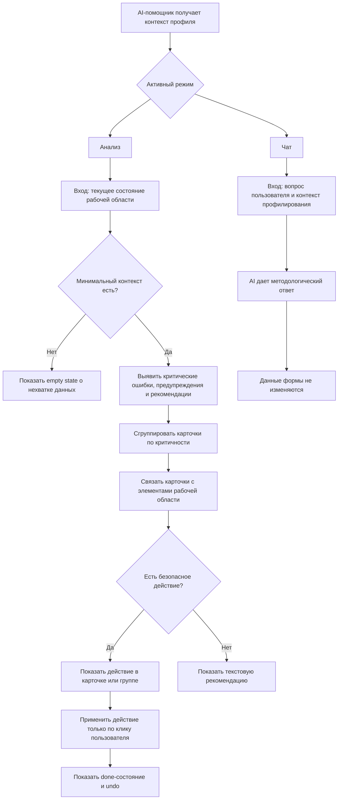

# AI-помощник: AI-логика

Документ описывает, как AI-помощник интерпретирует контекст после отказа от отдельного режима создания структуры профиля.

## Диаграмма режимов AI

AI-помощник работает в двух режимах: `Анализ` и `Чат`. Только `Анализ` может приводить к изменению данных, и только через явное действие пользователя в карточке или группе карточек.

## Общий принцип

AI-помощник работает в контексте профиля должности. Он не является универсальным чат-ботом без ограничений. Его контекст — профилирование, создание профиля, методология целей, задач, функций и компетенций.

## Анализ

Вкладка `Анализ` работает как методологический аудитор и основной action-режим AI-помощника.

AI должен:

- определить, хватает ли контекста для анализа;
- показать empty state, если данных недостаточно;
- сгруппировать замечания по критичности;
- связать карточки с конкретными элементами рабочей области;
- предложить действия там, где можно безопасно применить конкретное значение;
- предложить текстовые рекомендации там, где действие преждевременно или требует решения пользователя;
- дать возможность отката после выполненного действия.

Анализ не должен открывать и заполнять второй этап, если первый этап еще не дал минимальный контекст.

## Чат

Вкладка `Чат` — консультационный режим.

AI может:

- объяснять методологию профилирования;
- отвечать на вопросы о целях, задачах, функциях и компетенциях;
- пояснять шкалы и уровни;
- помогать понять, почему в анализе появляется конкретная рекомендация;
- давать рекомендации текстом.

AI не должен в режиме чата менять форму или применять значения.

## Контекстные подсказки

Подсказки AI зависят от текущего контекста:

- если профиль пустой, анализ показывает empty state и объясняет, каких данных не хватает;
- если указаны должность и место в структуре, но нет цели или задачи, анализ подсказывает, какой контекст нужно добавить;
- если есть цель, задача и функция, AI может анализировать второй этап и рекомендации по компетенциям;
- если пользователь находится во втором этапе, AI может объяснять шкалы, уровни и требования;
- если активна вкладка анализа, AI показывает проблемные места и действия.

## Имитация AI в прототипе

В текущем прототипе реальная LLM не подключена. AI-поведение имитируется через JavaScript:

- моковые ответы чата;
- анализ DOM-состояния формы;
- `setTimeout` для имитации обработки;
- заранее заданные действия и предложения.

Несмотря на имитацию, UX должен выглядеть так, будто AI анализирует профиль и работает с контекстом.

## Граница ответственности AI

AI может помогать, но не должен скрывать от пользователя смысл изменения.

Если AI предлагает действие, пользователь должен понимать:

- что изменится;
- где изменится;
- можно ли вернуть прежнее значение;
- почему это связано с методологией профилирования.
