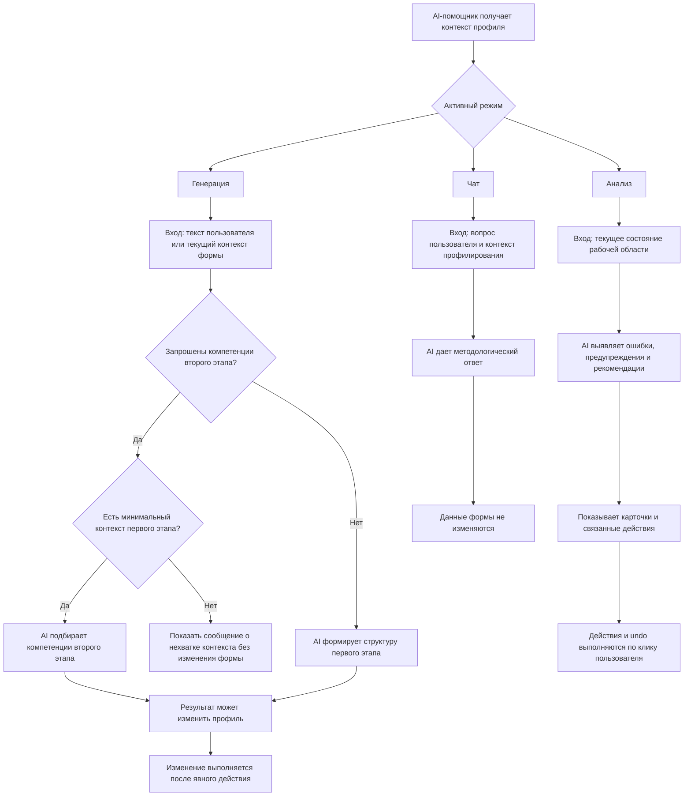

# AI-помощник: AI-логика

Документ описывает, как AI-помощник должен интерпретировать контекст и чем отличаются его режимы.

## Диаграмма режимов AI

Диаграмма фиксирует различие между тремя режимами AI-помощника. Главное правило: `Генерация` и `Анализ` могут приводить к изменению данных только через явное действие пользователя, а `Чат` остается консультационным.

## Общий принцип

AI-помощник работает в контексте профиля должности. Он не является универсальным чат-ботом без ограничений. Его контекст — профилирование, создание профиля, методология целей, задач, функций и компетенций.

## Генерация

Вкладка `Генерация` превращает текст пользователя или уже заполненный контекст формы в структурированные данные.

На первом этапе AI может сформировать:

- цель;
- задачу;
- функции;
- роли участия;
- доли участия;
- первичные формулировки функций.

На втором этапе AI должен использовать данные первого этапа и подобрать:

- Soft Skills;
- Hard Skills;
- языки и уровни;
- ПО и технологии;
- функциональные области;
- образование;
- опыт;
- сертификаты и допуски.

Генерация отличается от чата тем, что ее результат может изменить рабочую область.

## Анализ

Вкладка `Анализ` работает как методологический аудитор.

AI должен:

- определить, хватает ли контекста для анализа;
- показать empty state, если данных недостаточно;
- сгруппировать замечания по критичности;
- связать карточки с конкретными элементами рабочей области;
- предложить действия там, где можно безопасно применить конкретное значение;
- предложить текстовые рекомендации там, где действие преждевременно или требует решения пользователя;
- дать возможность отката после выполненного действия.

Анализ не должен открывать и заполнять второй этап, если первый этап еще не дал минимальный контекст.

## Чат

Вкладка `Чат` — консультационный режим.

AI может:

- объяснять методологию профилирования;
- отвечать на вопросы о целях, задачах, функциях и компетенциях;
- пояснять шкалы и уровни;
- помогать понять, почему AI предлагает определенные значения;
- давать рекомендации текстом.

AI не должен в режиме чата менять форму или применять значения.

## Контекстные подсказки

Подсказки AI должны зависеть от текущего контекста:

- если профиль пустой, сценарии генерации помогают начать;
- если указана должность, сценарии становятся более предметными;
- если есть цель, задача и функция, AI может предлагать компетенции;
- если пользователь находится во втором этапе, AI может объяснять шкалы, уровни и требования;
- если активна вкладка анализа, AI показывает проблемные места и действия.

## Имитация AI в прототипе

В текущем прототипе реальная LLM не подключена. AI-поведение имитируется через JavaScript:

- hardcoded-сценарии генерации;
- моковые ответы;
- анализ DOM-состояния формы;
- `setTimeout` для имитации обработки;
- заранее заданные действия и предложения.

Несмотря на имитацию, UX должен выглядеть так, будто AI анализирует профиль и работает с контекстом.

## Граница ответственности AI

AI может помогать, но не должен скрывать от пользователя смысл изменения.

Если AI предлагает действие, пользователь должен понимать:

- что изменится;
- где изменится;
- можно ли вернуть прежнее значение;
- почему это связано с методологией профилирования.
