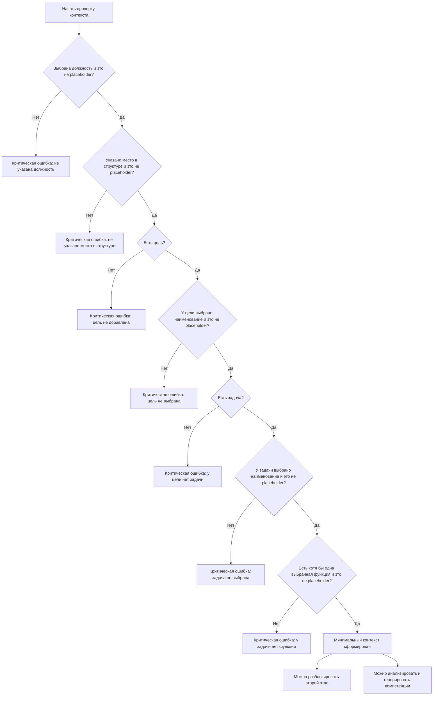

# AI-помощник: бизнес-правила

Документ фиксирует предметные правила, которые AI-помощник должен учитывать независимо от визуальной реализации.

## Диаграмма минимального контекста

Диаграмма фиксирует текущую логику определения минимального контекста. Именно она определяет, можно ли разблокировать второй этап и показывать рекомендации по ключевым компетенциям.

## Безопасность изменения данных

AI не должен менять данные профиля без явного действия пользователя.

Явными действиями считаются:

- отправка запроса на генерацию;
- выбор действия в карточке анализа;
- выбор конкретного предложенного значения;
- запуск массового действия группы анализа;
- возврат предыдущего значения.

Вкладка `Чат` не должна изменять данные профиля.

## Минимальный контекст первого этапа

Для ручного сценария должность и место в структуре дают только верхнеуровневый контекст. Их недостаточно для полноценного AI-подбора второго этапа.

Минимальный контекст для разблокировки второго этапа и рекомендаций по компетенциям:

- выбрана должность;
- указано место в структуре;
- есть хотя бы одна цель с выбранным наименованием, а не плейсхолдером;
- в цели есть хотя бы одна задача с выбранным наименованием, а не плейсхолдером;
- в задаче выбрана хотя бы одна функция, а не плейсхолдер строки функции.

Если этот контекст отсутствует, рекомендации второго этапа не должны открывать или заполнять заблокированный этап `Ключевые компетенции`.

## Критические ошибки

Критические ошибки отражают блокирующий дефицит контекста или жесткое нарушение методологии.

Текущие критические триггеры прототипа:

- не указана должность;
- не указано место в структуре;
- не добавлена цель;
- цель добавлена, но не выбрано ее наименование;
- у цели нет задачи;
- задача добавлена, но не выбрано ее наименование;
- у задачи нет выбранной функции;
- демонстрационная критическая проверка AI-черновика после быстрой генерации.

Критические ошибки должны помогать пользователю восстановить минимальный контекст, а не подменять его догадками AI.

## Предупреждения

Предупреждения не обязательно блокируют движение дальше, но показывают недостаточную глубину или качество заполнения.

Текущие предупреждающие триггеры:

- у задачи меньше 5 выбранных функций;
- не указана доля участия в задаче;
- для выбранного языка не указан уровень;
- есть потенциальный разрыв между функциями и заполнением компетенций.

Предупреждения могут содержать действия, если AI может безопасно добавить недостающие элементы или предложить корректировку.

## Рекомендации

Рекомендации помогают обогатить профиль и сделать его методологически точнее.

Текущие рекомендательные триггеры:

- функция лучше формулируется глаголом;
- не заполнен раздел ключевых компетенций;
- отсутствуют релевантные Soft Skills;
- отсутствуют релевантные Hard Skills;
- не заполнены технологии или ПО;
- не заполнены функциональные области;
- требования к образованию или опыту нуждаются в проверке соразмерности.

Рекомендация может содержать действие только тогда, когда есть конкретное значение для добавления, удаления, замены или установки.

## Лимиты и методологические ограничения

Soft Skills не должны превращаться в универсальный список качеств. В прототипе используется лимит до 8 Soft Skills.

Функции должны описывать действия. Методологически предпочтительны формулировки с глаголом, а не отглагольным существительным.

Задача должна быть раскрыта через набор функций. Методологический ориентир — 5 и более функций на задачу.

Компетенции второго этапа должны быть связаны с функциями первого этапа.

## Обратимость действий

Если AI-действие изменяет данные, система должна по возможности сохранить предыдущее значение и показать возврат.

Если действие необратимо или восстановление невозможно, это должно быть явно учтено в логике карточки и не маскироваться под безопасный undo.
