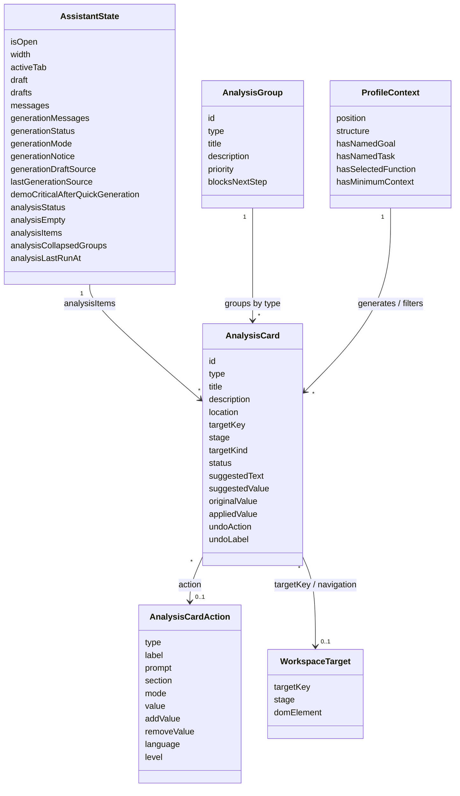

# AI-помощник: модель данных

Документ описывает основные структуры данных AI-помощника и их роль в прототипе.

Подробная спецификация карточек анализа находится в `docs/components/profile-ai-assistant/analysis-card-model.md`.

## Диаграмма сущностей AI-помощника

Диаграмма показывает основные структуры данных, которые используются AI-помощником в текущем прототипе.



## Состояние панели

Состояние AI-помощника хранится в:

```text
src/features/profile-ai-assistant/state/profile-ai-assistant.state.js
```

Ключевые группы состояния:

- открыта ли панель;
- ширина панели;
- активная вкладка;
- черновики ввода для генерации и чата;
- сообщения чата;
- сообщения генерации;
- статус генерации;
- режим генерации первого этапа или компетенций;
- статус анализа;
- empty state анализа;
- список карточек анализа;
- свернутые группы анализа;
- источник последней генерации.

## AnalysisCard

`AnalysisCard` — основная сущность вкладки `Анализ`.

Базовая структура:

```js
AnalysisCard = {
  id: string,
  type: "critical" | "warning" | "recommendation" | "success",
  title: string,
  description: string,
  location: string,
  targetKey: string,
  stage: "functional" | "competencies",
  targetKind: string,
  suggestedText?: string,
  suggestedValue?: string,
  action?: AnalysisCardAction,
  status?: "active" | "done",
  originalValue?: string,
  appliedValue?: string,
  undoAction?: object,
  undoLabel?: string
}
```

`targetKey` связывает карточку с элементом рабочей области. На этой связи основаны подсветка, скролл и переход между этапами.

`status` определяет актуальность карточки. После выполнения действия карточка может перейти в `done`, но не исчезает из списка.

## AnalysisCardAction

Действие описывает явное изменение или навигацию, которую пользователь запускает из карточки.

Примеры типов действий:

- `focus_target` — перейти к связанному элементу;
- `switch_generation` — применить генерационный сценарий к рабочей области;
- `apply_competency_value` — добавить, удалить, заменить или установить значение второго этапа.

Для рекомендаций второго этапа действие должно быть конкретным: например, добавить `Jira`, удалить лишний Hard Skill или установить уровень языка.

## Предложение и действие

Карточка должна содержать один нижний смысловой блок:

- `suggestedText` — неинтерактивное предложение;
- `suggestedValue` — конкретное значение для применения;
- `action` — явное действие.

Если одна логическая проблема требует и предложения, и действия, модель должна разделить ее на две карточки.

## Группы анализа

Карточки группируются по типу:

```js
AnalysisGroup = {
  id: string,
  type: "critical" | "warning" | "recommendation" | "success",
  title: string,
  description: string,
  priority: number,
  blocksNextStep: boolean
}
```

Группы используются для визуального аккордеона и массовых действий.

## Данные и примеры

Файлы данных компонента:

```text
src/features/profile-ai-assistant/data/profile-ai-assistant.analysis-card.mock.js
src/features/profile-ai-assistant/data/profile-ai-assistant.analysis-card.examples.json
src/features/profile-ai-assistant/data/profile-ai-assistant.mock.js
```

`profile-ai-assistant.analysis-card.examples.json` нужен для человеко-читаемой демонстрации структуры карточек. Он не должен становиться конкурирующим источником истины для runtime-логики.

`profile-ai-assistant.analysis-card.mock.js` содержит JS-примеры и может использоваться как витрина структуры для будущего прототипирования.

## Связь с моделью профиля

AI-помощник не владеет всей моделью профиля. Он работает поверх сущностей профиля:

- должность;
- место в структуре;
- цель;
- задача;
- функция;
- Soft Skills;
- Hard Skills;
- языки;
- технологии;
- образование;
- опыт;
- функциональные области;
- сертификаты и допуски.

Единая модель профиля описана в:

```text
docs/profile-entity-model.md
src/domain/profile-model.js
```

