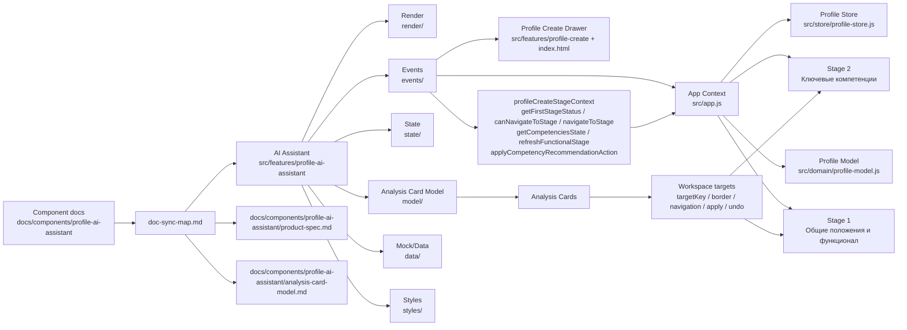

# AI-помощник: интеграции

Документ описывает связи AI-помощника с другими частями прототипа.

## Диаграмма интеграций

Диаграмма показывает, с какими частями прототипа связан AI-помощник и какие документы помогают поддерживать эту связь.



## Связь с интерфейсом создания профиля

AI-помощник работает внутри drawer создания профиля и синхронизируется с двумя этапами:

- `Общие положения и функционал`;
- `Ключевые компетенции`.

Он должен знать, какой этап активен, и уметь переключить рабочую область при клике по карточке анализа, если целевой элемент находится на другом доступном этапе.

## Минимальный контекст первого этапа

AI-помощник получает статус первого этапа через контекст создания профиля. Минимальный контекст нужен для:

- разблокировки второго этапа;
- подбора компетенций;
- отображения рекомендаций второго этапа;
- корректной навигации из карточек анализа.

Если минимального контекста нет, AI не должен переходить к закрытому второму этапу через карточки анализа.

## Связь с рабочей областью анализа

Каждая карточка анализа может иметь `targetKey`. Этот ключ связывает карточку с DOM-элементом рабочей области.

На основе этой связи работают:

- border-индикация поля;
- скролл к элементу;
- подсветка элемента;
- переход между этапами перед навигацией;
- применение значения;
- откат действия.

## Связь с действиями рабочей области

Действия анализа выполняются через API контекста приложения, а не через изолированную логику панели.

Ключевые runtime-контракты сейчас находятся в `window.HRProfileApp`:

- `profileCreateStageContext.getFirstStageStatus`;
- `profileCreateStageContext.canNavigateToStage`;
- `profileCreateStageContext.navigateToStage`;
- `profileCreateStageContext.getCompetenciesState`;
- `profileCreateStageContext.refreshFunctionalStage`;
- `profileCreateStageContext.applyCompetencyRecommendationAction`.

AI-помощник инициирует действие, но фактическое изменение данных должно проходить через согласованные функции рабочей области.

## Связь с моделью профиля

AI-помощник должен учитывать модель профиля, но не заменять ее.

Глобальная модель профиля описывает сущности и вложенность:

```text
Профиль → Цели → Задачи → Функции
Профиль → Ключевые компетенции и требования
```

AI-помощник использует эту модель для анализа и действий карточек, но не должен создавать параллельную несовместимую структуру данных.

## Связь с документацией

Основные документы:

```text
docs/components/profile-ai-assistant/product-spec.md
docs/components/profile-ai-assistant/analysis-card-model.md
docs/profile-entity-model.md
docs/components/profile-ai-assistant/
```

Если меняется атрибутивный состав карточки анализа, нужно обновить:

- `docs/components/profile-ai-assistant/data-model.md`;
- `docs/components/profile-ai-assistant/analysis-card-model.md`;
- `src/features/profile-ai-assistant/model/profile-ai-assistant.analysis-card.model.js`;
- JSON/JS-примеры в `src/features/profile-ai-assistant/data/`, если они затронуты.

Если меняется поведение вкладок, нужно обновить соответствующий слой компонентной документации: `user-flows.md`, `ui-interactions.md`, `ai-logic.md` или `business-rules.md`.

## Связь с будущими компонентами

AI-помощник сейчас наиболее подробно документированный компонент. Для других компонентов не нужно автоматически копировать такой же набор файлов.

Новые документы для других компонентов создаются по правилу адаптивной документации из `AGENTS.md`.

