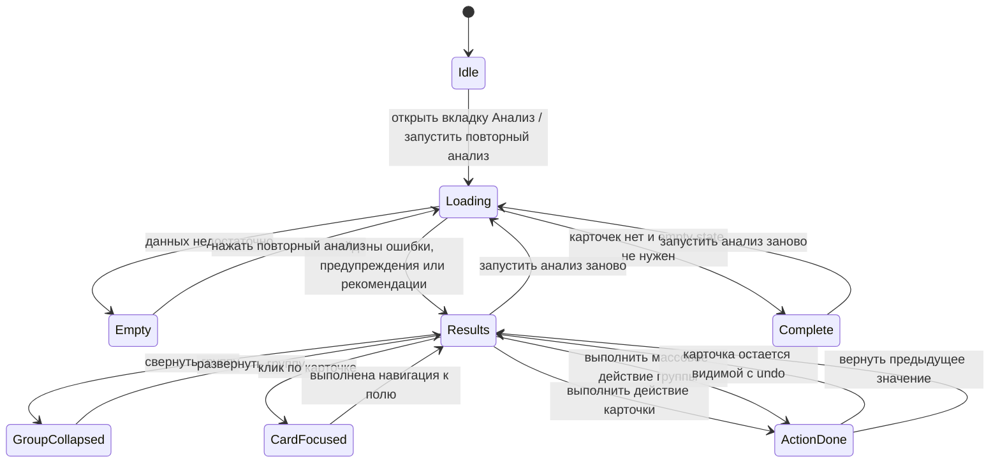
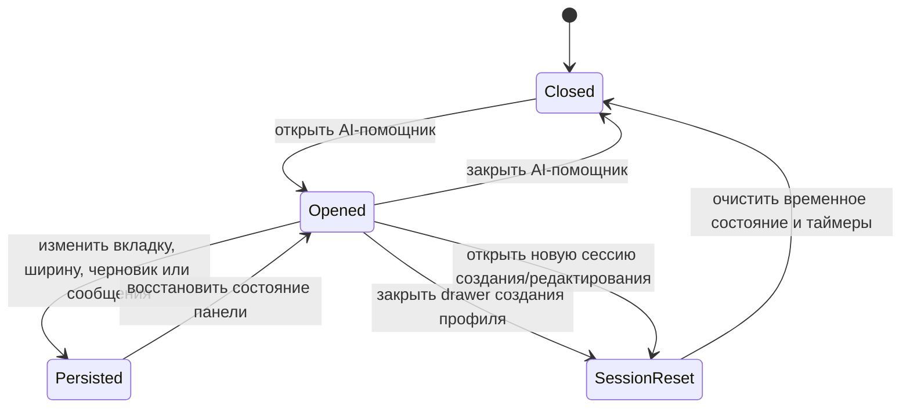

# AI-помощник: UI-взаимодействия

Документ описывает реакции интерфейса на действия пользователя. Здесь фиксируется поведение UI, а не бизнес-смысл правил.

## Диаграмма состояний вкладки «Анализ»

Диаграмма описывает текущую UI-механику анализа: запуск проверки, loader, empty state, группы карточек, состояние без найденных карточек, выполнение действия и возврат предыдущего значения.

## Панель

AI-помощник отображается как правый drawer внутри интерфейса создания профиля.

Панель содержит:

- хедер с названием `ИИ-Помощник` и контекстом текущего этапа;
- segmented control `Анализ | Чат`;
- основную область вкладки;
- футер с кнопкой повторного анализа или полем ввода чата.

Панель может оставаться открытой при переключении этапов создания профиля.

## Lifecycle панели

Состояние AI-помощника частично сохраняется между перерисовками панели:

- ширина панели;
- активная вкладка;
- черновик ввода чата;
- сообщения чата;
- результат анализа и свернутые группы.

При закрытии интерфейса создания профиля или открытии новой сессии создания профильной формы выполняется сброс сессии AI-помощника. Сброс должен:

- закрыть AI-панель;
- вернуть активную вкладку к `Анализ`;
- очистить временные результаты анализа;
- остановить отложенные операции анализа, чтобы старый результат не применился к новой форме.

## Segmented control

Два режима должны быть визуально едины, но функционально различимы:

- `Анализ` — группы карточек и кнопка повторного анализа;
- `Чат` — консультационные вопросы и поле `Задайте вопрос`.

Активный сегмент должен быть визуально выделен. Неактивные сегменты сохраняют единый цвет текста и font-weight 500.

## Вкладка «Анализ»

При запуске анализа отображается loader. Loader должен быть отдельным блоком в свободной области контента, а не перекрывать уже существующие карточки.

После анализа карточки группируются в аккордеоны:

- критические ошибки;
- предупреждения;
- рекомендации;
- исправленные состояния, если они используются явно.

Каждая группа может быть свернута и развернута. В правой части хедера группы находится кнопка сворачивания/разворачивания. Если в группе есть массовое действие, кнопка массового действия находится рядом.

## Карточка анализа

Карточка содержит:

- хедер с иконкой-метафорой и названием проблемы;
- описание;
- нижний блок предложения, действия или возврата.

Карточка не должна одновременно показывать предложение и действие. Если нужны оба смысла, они должны быть разделены на две карточки.

После выполнения действия карточка остается видимой. Иконка в хедере меняется на галочку. Карточка показывает блок возврата предыдущего значения, если откат доступен.

Блок действия:

- белый фон;
- серый бордер;
- синий бордер при наведении;
- синяя иконка на голубой подложке.

Блок предложения:

- светло-серая заливка;
- без бордера;
- без hover-эффекта.

Блок возврата:

- белый фон;
- серый бордер;
- синий бордер при наведении;
- иконка возврата на серой подложке;
- текст `Вернуть предыдущее значение` с font-weight 500.

## Индикация в рабочей области

Индикации анализа видны только при активной вкладке `Анализ`.

Для селектов и текстовых полей индикация должна отображаться как окрашенный border самого поля. Цвет соответствует типу карточки:

- критическая ошибка — красный;
- предупреждение — янтарный/оранжевый;
- рекомендация — синий/фиолетовый.

Если поле является селектом, иконка раскрытия dropdown должна оставаться корректной. Дополнительные индикаторы не должны ломать правую зону селекта.

## Навигация по карточке

Клик по карточке анализа выполняет навигацию к связанному элементу рабочей области.

Если карточка относится ко второму этапу, но пользователь находится на первом этапе, система сначала переключает рабочую область на `Ключевые компетенции`, если этот этап доступен.

Если второй этап заблокирован из-за отсутствия минимального контекста, карточки второго этапа не должны принудительно открывать его.

## Вкладка «Чат»

Чат должен восприниматься как безопасная консультация.

Под приветственным сообщением отображаются быстрые вопросы. Поле ввода имеет placeholder `Задайте вопрос`.

Кнопка отправки круглая, с иконкой, без текста.

Сообщения AI и пользователя отображаются как диалог. Ответы чата не меняют значения формы.
