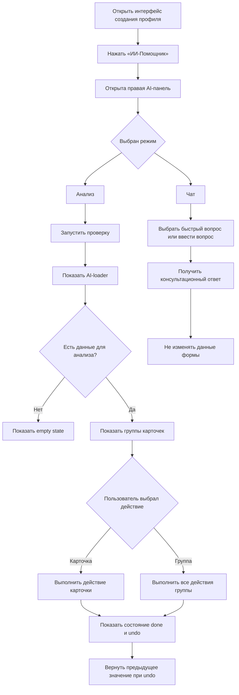

# AI-помощник: пользовательские сценарии

Документ описывает путь пользователя при работе с AI-помощником. Здесь фиксируется последовательность действий, а не техническая реализация.

## Диаграмма пользовательских путей

Диаграмма отражает текущие основные пользовательские пути AI-помощника: открытие панели, анализ, массовые действия, возврат значения и консультационный чат.

## Сценарий 1. Открытие AI-помощника

1. Пользователь открывает интерфейс создания профиля.
2. Пользователь нажимает `ИИ-Помощник` в хедере мастера создания профиля.
3. Справа открывается AI-панель.
4. По умолчанию пользователь видит segmented control с режимами `Анализ` и `Чат`.
5. Панель остается открытой при переходе между этапами создания профиля.

Ожидаемый результат: пользователь может продолжать работу с формой и AI-панелью параллельно.

## Сценарий 2. Ручное формирование контекста и переход ко второму этапу

1. Пользователь вручную выбирает должность.
2. Пользователь указывает место в структуре.
3. Пользователь добавляет или выбирает цель.
4. Пользователь добавляет или выбирает задачу.
5. Пользователь выбирает хотя бы одну функцию.
6. Карточка `Ключевые компетенции` становится доступной.
7. Пользователь может перейти ко второму этапу.

Ожидаемый результат: второй этап открывается только после появления минимального контекста.

## Сценарий 3. Анализ заполнения

1. Пользователь открывает вкладку `Анализ`.
2. AI показывает лоудер проверки.
3. После проверки появляются группы карточек: критические ошибки, предупреждения и рекомендации.
4. Пользователь может кликнуть по карточке, чтобы перейти к связанному месту рабочей области.
5. Если карточка содержит действие, пользователь может выполнить его прямо из карточки.
6. После выполнения действия карточка остается в списке и показывает возможность вернуть прежнее значение.

Ожидаемый результат: анализ не просто сообщает о проблеме, а помогает перейти к месту проблемы и исправить ее.

## Сценарий 4. Массовое действие в группе анализа

1. В группе анализа есть несколько карточек с действиями.
2. Пользователь нажимает кнопку массового действия в хедере группы.
3. Все доступные действия внутри группы выполняются одним кликом.
4. Выполненные карточки остаются видимыми и переходят в состояние выполненного действия.
5. Если все действия группы выполнены, кнопка группы меняется на возврат.

Ожидаемый результат: пользователь не должен нажимать массовую кнопку несколько раз для выполнения всех действий группы.

## Сценарий 5. Возврат предыдущего значения

1. Пользователь выполнил действие в карточке анализа.
2. Карточка показывает блок `Вернуть предыдущее значение`.
3. Пользователь нажимает этот блок.
4. Система возвращает предыдущее значение, если действие обратимо.
5. Карточка возвращается в активное состояние.

Ожидаемый результат: AI-действия остаются безопасными и обратимыми там, где это возможно.

## Сценарий 6. Консультация в чате

1. Пользователь открывает вкладку `Чат`.
2. Пользователь выбирает быстрый вопрос или вводит свой вопрос.
3. AI отвечает в формате диалога.
4. Данные профиля не изменяются.

Ожидаемый результат: пользователь получает методологическую помощь без риска случайно изменить форму.
