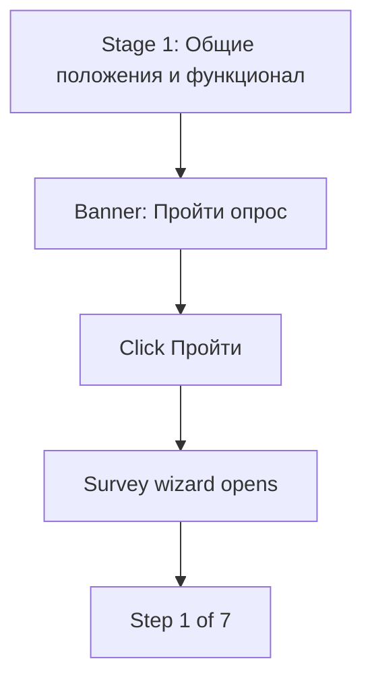
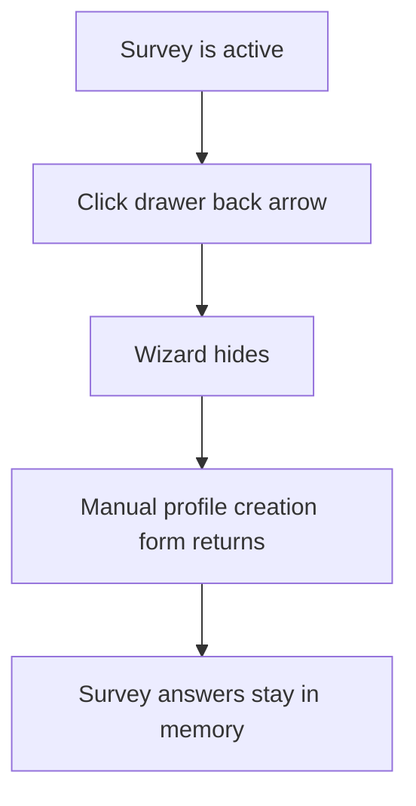
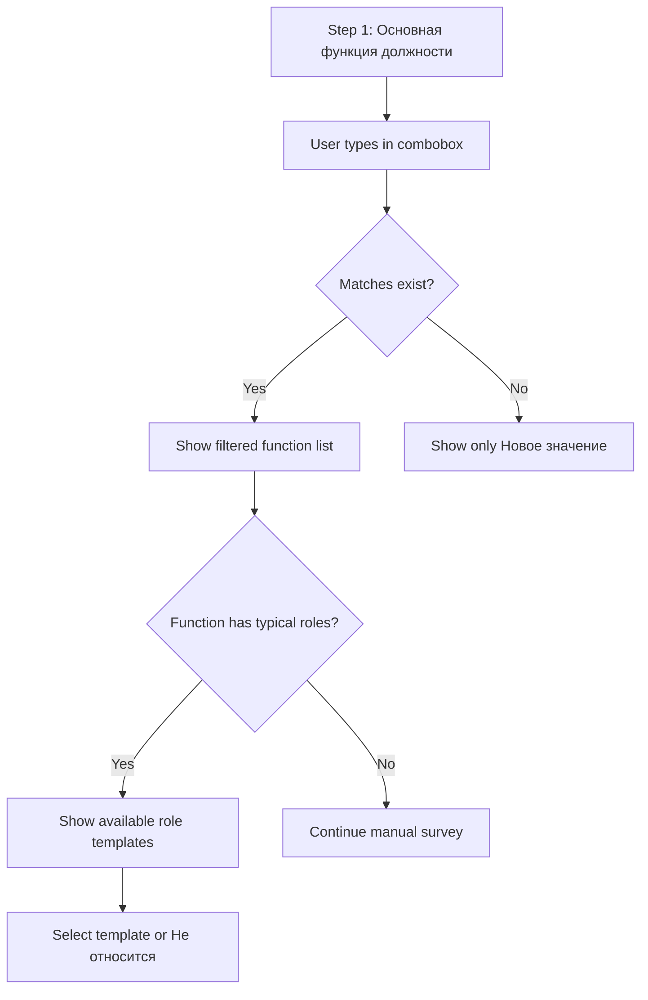
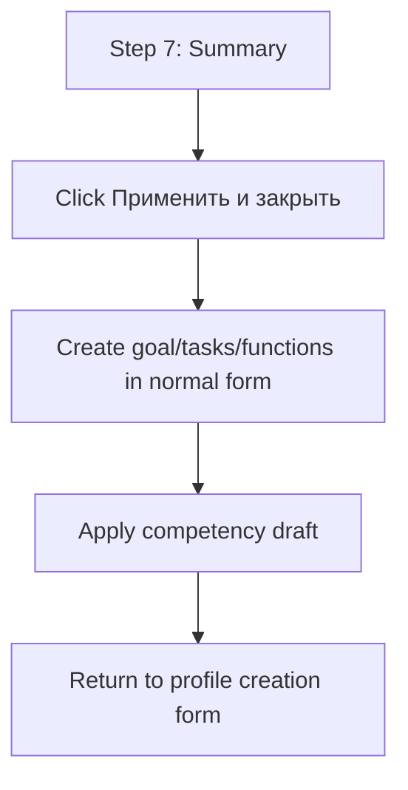

# Profile Survey User Flows

## Flow 1. Start Survey

```mermaid
flowchart TD
  A["Stage 1: Общие положения и функционал"] --> B["Banner: Пройти опрос"]
  B --> C["Click Пройти"]
  C --> D["Survey wizard opens"]
  D --> E["Step 1 of 7"]
```

## Flow 2. Manual Exit

```mermaid
flowchart TD
  A["Survey is active"] --> B["Click drawer back arrow"]
  B --> C["Wizard hides"]
  C --> D["Manual profile creation form returns"]
  D --> E["Survey answers stay in memory"]
```

## Flow 3. Function And Template Selection

```mermaid
flowchart TD
  A["Step 1: Основная функция должности"] --> B["User types in combobox"]
  B --> C{"Matches exist?"}
  C -->|Yes| D["Show filtered function list"]
  C -->|No| E["Show only Новое значение"]
  D --> F{"Function has typical roles?"}
  F -->|Yes| G["Show available role templates"]
  F -->|No| H["Continue manual survey"]
  G --> I["Select template or Не относится"]
```

## Flow 4. Apply Result

```mermaid
flowchart TD
  A["Step 7: Summary"] --> B["Click Применить и закрыть"]
  B --> C["Create goal/tasks/functions in normal form"]
  C --> D["Apply competency draft"]
  D --> E["Return to profile creation form"]
```
