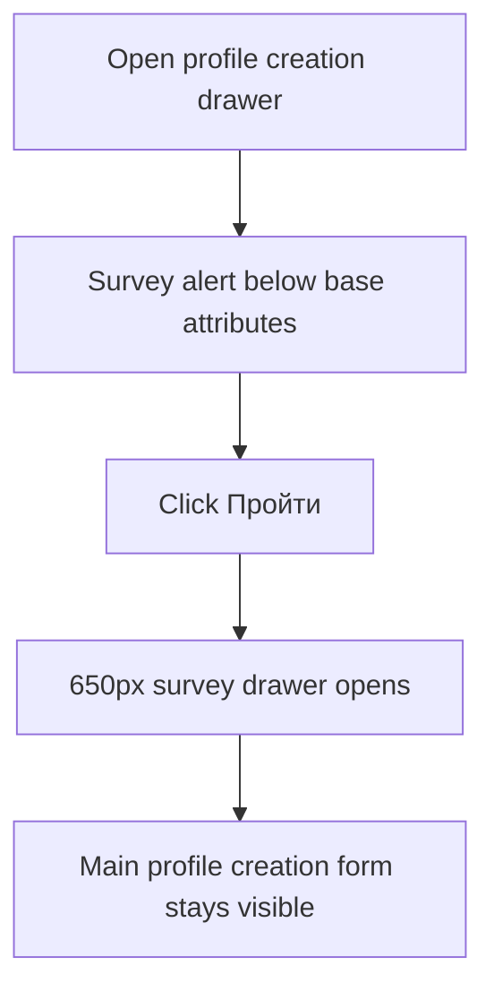
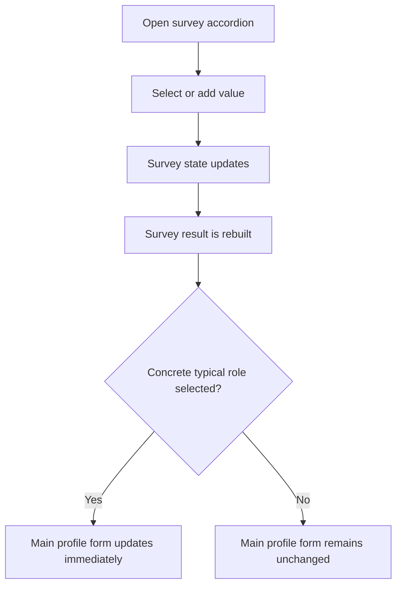
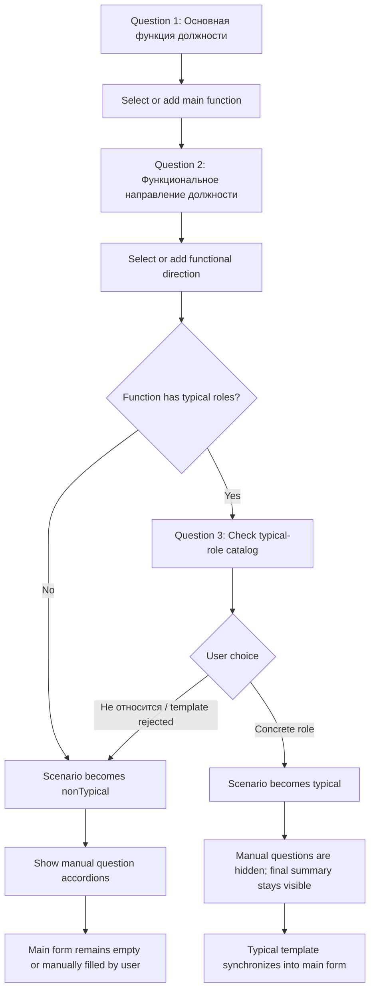
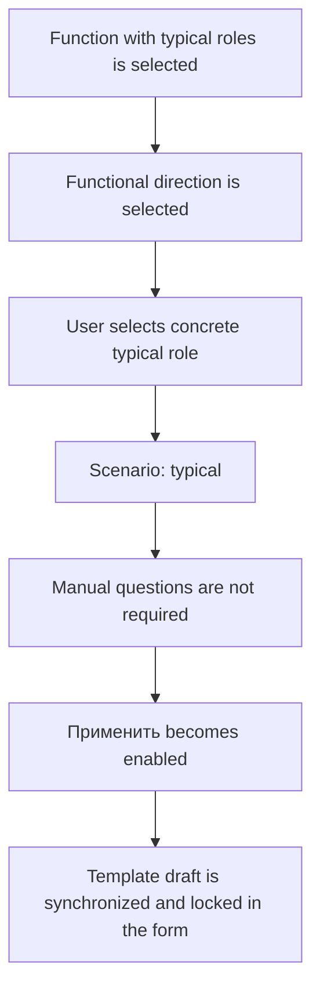
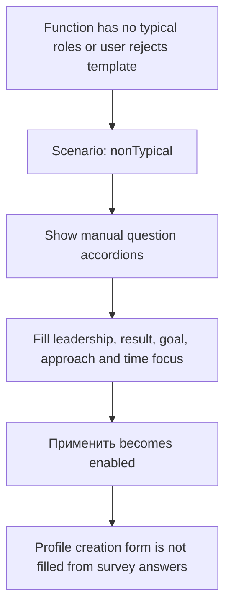
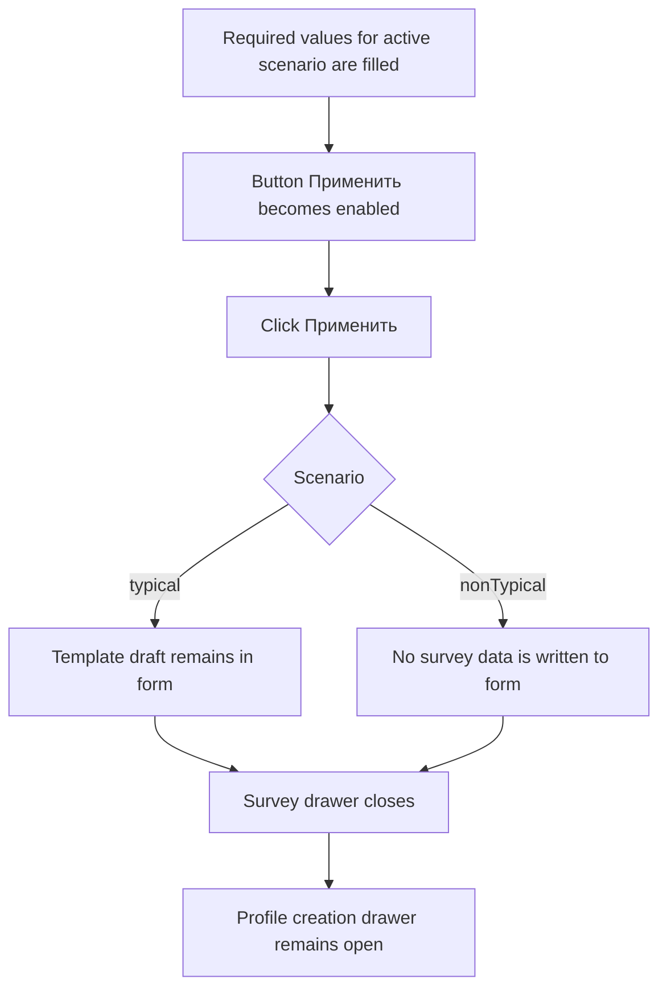
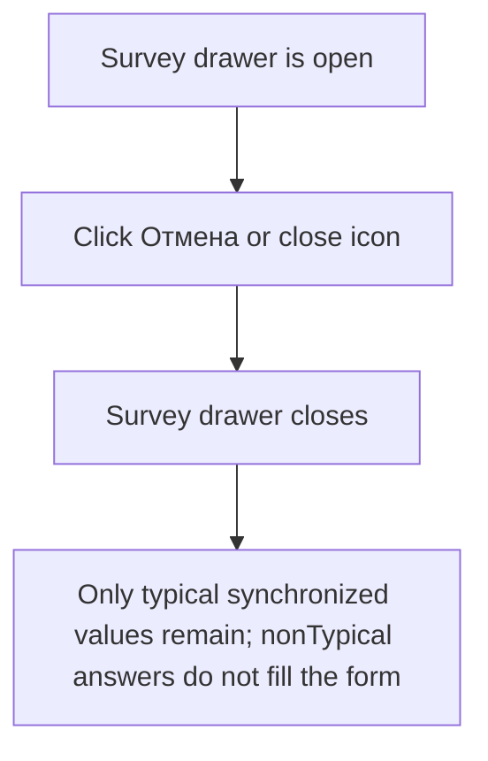

# Profile Survey User Flows

## Flow 1. Start Survey Drawer

## Flow 2. Fill Values With Scenario-Based Sync

## Flow 3. Function, Direction And Template Selection

## Flow 4. Typical Scenario

## Flow 5. Non-Typical Scenario

## Flow 6. Apply Survey

## Flow 7. Close Survey Drawer Without Creating

